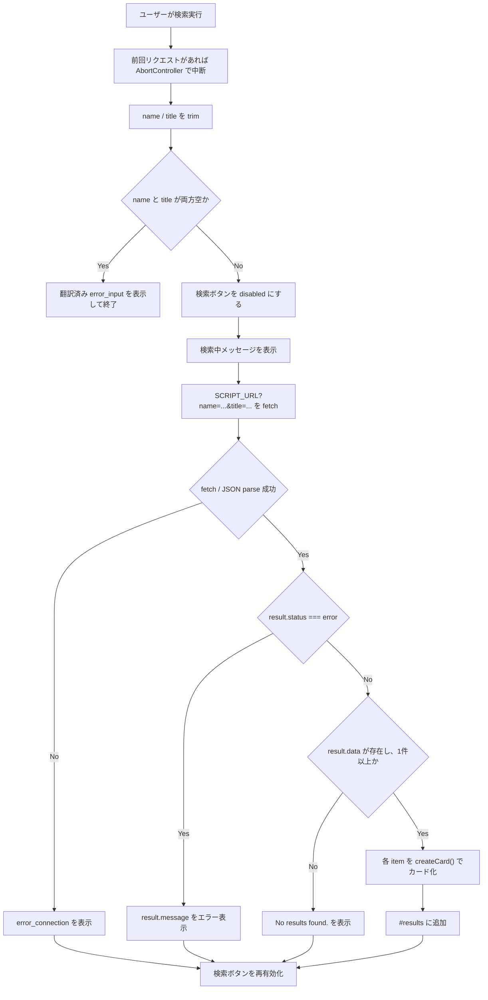

# Frontend Flow

このドキュメントは、WanderingSea フロントエンドの画面イベントと処理フローを整理する。

関連ドキュメント:

- `docs/architecture.md`
- `docs/gas-api.md`
- `docs/i18n.md`
- `docs/testing-checklist.md`

## 対象ファイル

| ファイル | 主な責務 |
|---|---|
| `index.html` | DOM 構造、CSS/JS 読み込み、外部 analytics 読み込み。 |
| `js/config.js` | GAS API URL 定数の定義。 |
| `js/i18n.js` | 翻訳 JSON 読み込み、文言反映、言語切替。 |
| `js/link-loader.js` | 言語別フッターリンクの読み込み。 |
| `js/search.js` | 検索、結果描画、ID コピー。 |
| `js/update-status.js` | 最新掲載状況の JSONP 読み込み。 |

## Script 読み込み順

`index.html` では以下の順に JavaScript が読み込まれる。

1. `js/config.js`
2. `js/link-loader.js`
3. `js/i18n.js`
4. `js/search.js`
5. `js/update-status.js`
6. Cloudflare Web Analytics

注意点:

- `SCRIPT_URL` と `LAST_UPDATE_API_URL` は `config.js` で先に定義される必要がある。
- `setLang()` は HTML の `onclick` から呼ばれるため、グローバル関数として存在する必要がある。
- `callback()` は JSONP から呼ばれるため、グローバル関数として存在する必要がある。
- `i18n.js` の `setLang()` は `escapeHtml()` を参照する。`escapeHtml()` は `search.js` にあるため、読み込み順や実行タイミングを変える場合は注意する。

## 初期表示フロー

```mermaid
sequenceDiagram
    participant Browser
    participant HTML as index.html
    participant Config as js/config.js
    participant Links as js/link-loader.js
    participant I18n as js/i18n.js
    participant Status as js/update-status.js
    participant Lang as lang/language.json
    participant LinkFile as link/link_{lang}.txt
    participant GAS as LAST_UPDATE_API_URL

    Browser->>HTML: ページ読み込み
    HTML->>Config: API URL 定数を定義
    HTML->>Links: script 読み込み
    HTML->>I18n: script 読み込み
    HTML->>Status: script 読み込み
    Links->>LinkFile: DOMContentLoaded でリンクファイル取得
    Links->>HTML: #footer-links を生成
    I18n->>Lang: window.load で翻訳 JSON 取得
    I18n->>HTML: data-i18n / placeholder を反映
    I18n->>Links: loadLinks(lang) を再実行
    Status->>GAS: window.load で JSONP script を追加
    GAS-->>Status: callback({ last_updated })
    Status->>HTML: #last-update-time を更新
```

## 言語切替フロー

1. ユーザーが `JP` または `EN` ボタンを押す。
2. `onclick` から `setLang('ja')` または `setLang('en')` が呼ばれる。
3. `setLang()` は `translations[lang]` が存在する場合のみ処理を継続する。
4. 選択言語を `localStorage` の `lang` に保存する。
5. `[data-i18n]` 要素に翻訳テキストを反映する。
6. `[data-i18n-placeholder]` 要素に placeholder を反映する。
7. `description_tail` の `[link_how_to]` を YouTube リンク HTML に置換する。
8. `loadLinks(lang)` が存在する場合、言語別リンクを再読み込みする。

## 検索フロー



## 検索結果カード生成

`createCard(item, lang)` は以下の DOM を生成する。

```text
div.card
├── div.card-id
│   ├── span: item.id
│   └── span.material-icons.copy-icon: content_copy
└── div.card-details
    ├── label_date + item.date
    ├── label_sender + item.name
    └── label_title + item.title
```

表示項目:

| フィールド | 表示内容 |
|---|---|
| `item.id` | 結果カード上部の ID。コピー対象。 |
| `item.date` | 投函日。 |
| `item.name` | 差出人。 |
| `item.title` | タイトル。 |

## ID コピーフロー

1. ユーザーがコピーアイコンを押す。
2. `copyId(id, iconEl)` が呼ばれる。
3. `navigator.clipboard.writeText(id)` で ID をコピーする。
4. 成功時、アイコン文字列を `check` に変える。
5. アイコン色を `var(--accent-color)` に変える。
6. 1.5 秒後、元のアイコン文字列と色に戻す。

## エラー表示

| 状況 | 表示 |
|---|---|
| 入力が両方空 | `translations[lang].error_input` |
| GAS が `status: "error"` を返す | `result.message` |
| fetch 失敗 | `translations[lang].error_connection` |
| AbortError | 表示更新せず終了 |
| `data` が空または存在しない | `No results found.` |

注意:

- `debug_error` は専用表示がない。現在は `status: "error"` 以外かつ `data` 不在として処理される可能性がある。
- `No results found.` は翻訳 JSON を使っていない。

## DOM とイベント一覧

| DOM | イベント | ハンドラ |
|---|---|---|
| `#name` | `keypress` Enter | `search()` |
| `#title` | `keypress` Enter | `search()` |
| `#searchButton` | `click` | `search()` |
| `JP` ボタン | `click` | `setLang('ja')` |
| `EN` ボタン | `click` | `setLang('en')` |
| `.copy-icon` | `click` | `copyId(item.id, copyIcon)` |
| `window` | `load` | `loadLanguage()` |
| `window` | `load` | 最新掲載状況 JSONP 読み込み |
| `document` | `DOMContentLoaded` | 初期フッターリンク読み込み |

## 要確認

- `i18n.js` と `search.js` の `escapeHtml()` 依存を現在のまま仕様とするか。
- `debug_error` をユーザー向けエラーとして表示するか。
- `No results found.` を翻訳対象に追加するか。
- `keypress` は古いイベントであるため、将来 `keydown` に移行するか。
